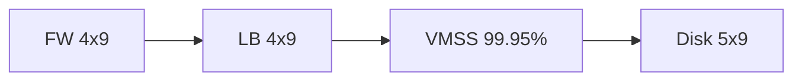

# Agartha

> There's a whole world below us!

# Server Infrastructure

Infrastructure should favor:

- Low latency
    - Eliminate or reduce partitioning that may increase latency.
    - Minimize redunduncies that increase latency.
    - Reduce distance between data and workload whenever possible.
    - Go "headless" (no db) if referential integrity is not needed.
    - Reduce distance between userbase and workload.  For starters, ensure that P75 of the userbase are within two timezones on the same hemisphere as the workload.
    - Disk IOPS should be proportional to load.  For starters, make the best effort to make the average IOPS equal or higher than the average request-per-second load.
    - Replica count of workloads within a single virtual machine should be a multiple of the virtual machine's vCPU.
- Three-nine Uptime minimum
- RPO: 4 hours maximum
- MTTR: 4 hours maximum
- Immutable and evergreen virtual machines for best security
    - Ensure workloads have no root or administrative privileges in the operating system.
    - Ensure that root or administrative accounts are deleted or disabled in the oeprating system.
    - Ensure that virtual machines and workloads are immutable.  Once the virtual machine instance and workloads are deployed, they cannot be changed.
    - Ensure that the operating system and workloads are evergreen.  The virtual machines should be rebooting every night in order to apply the latest updates.  On reboot, the operating system should deploy the latest workloads and discard the old workloads.
- Only use high-strength cryptographic keys for authentication (ED25519 only)
- Firewall with layer 3 and layer 7 protection serves as the edge of the trust zone.  There should be no more than three people at any given time with administrative access to machines within the trust zone.  This access must be reviewed and assessed periodically (every quarter for starters).

# Web Experience

Web pages and web apps should favor an always-on experience and minimal XSS attack surface.

- Evergreen service worker: Service workers should only use `StaleWhileRevalidate` or `NetworkFirst` for assets and data.
- Immutable javascript modules and cascading stylesheets: Never use inline `<script>` or `<style>` tags.  Ensure that javascript files and cascading stylesheets are minified into files with unique names.  Never reuse or write over these names that's already been deployed.
- Fast-loading assets:  Assets that need to load fast should be minified to less than 244 kb in order to overcome the current implementations of TCP slow start.
